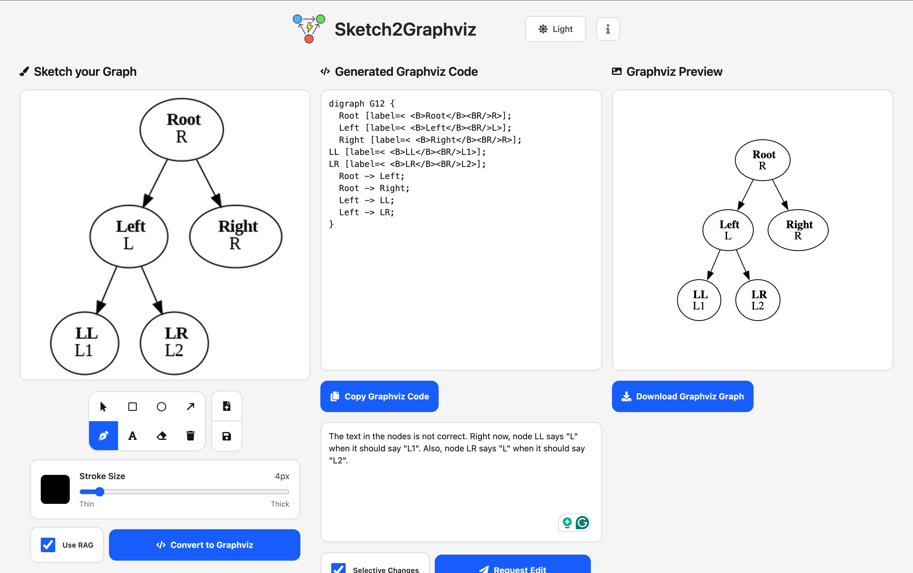
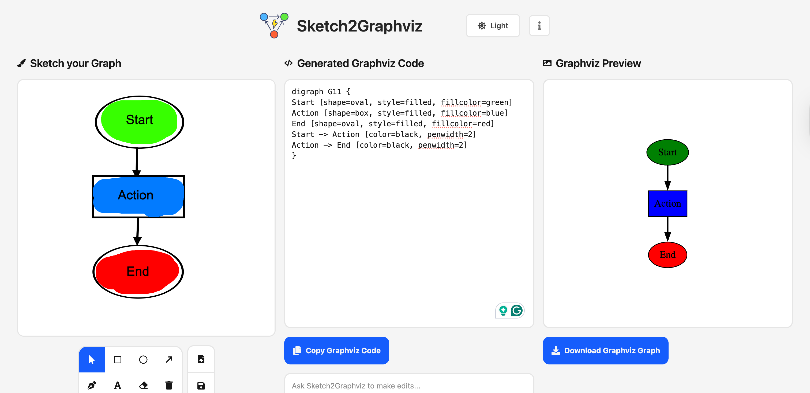
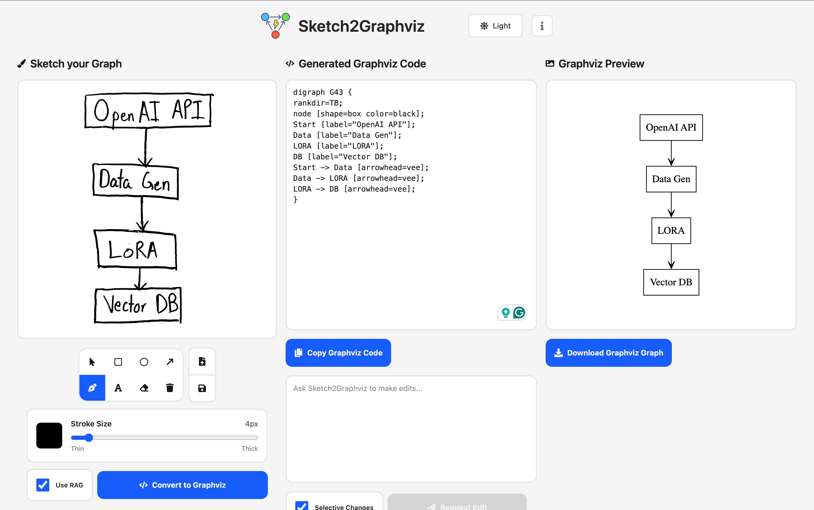
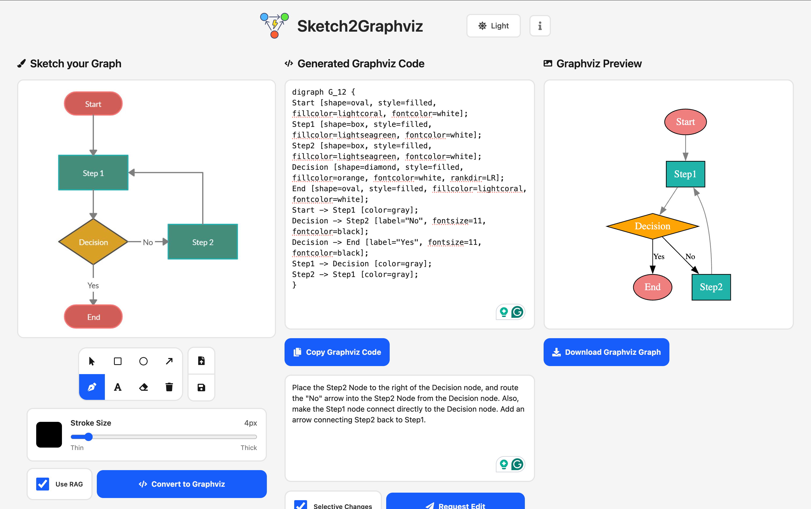

# Sketch2Graphviz


 

 

**Sketch2Graphviz** allows you to convert sketches or images of graphs and flowcharts to proper Graphviz code using a **LoRA fine-tuned Llama 3.2 11B Vision** and **Retrieval-Augmented Generation (RAG)** through a vector database built with PostgreSQL and PGVector, making a previously tedious and manual task fast, effortless, and automated.

The client-side web application uses React JS, Vite, and Tailwind CSS.
The server uses FastAPI and is deployed with Docker.

## Setup

The server uses Docker and can be deployed to services such as Runpod to be run with FastAPI and have GPU access. The public docker image can be accessed at **[rishabsa/sketch2graphviz:latest](https://hub.docker.com/r/rishabsa/sketch2graphviz)** on DockerHub.

For my setup, I used [Runpod](https://www.runpod.io/) to host my FastAPI server with GPU access.

### Runpod Setup

Create a pod with an appropriate GPU (~12-16 GB VRAM for the 4-bit quantized model or ~24 GB VRAM for the 16-bit quantized model). For my purposes, I deployed the 4-bit quantized model on a RTX A5000 with 24 GB VRAM.

- Use the **rishabsa/sketch2graphviz:latest** docker image as the template on Runpod
- Set the container disk and volume disk storage both to ~40 GB
- Expose HTTP port `8000`
- Set an environment variable with the key `HF_TOKEN` and the value being a huggingface token with read permissions
  - Note: Make sure that you have been granted access to `meta-llama/Llama-3.2-11B-Vision-Instruct` on HuggingFace as it is a gated model
- Uncheck "Start Jupyter notebook"
- Deploy the pod on-demand

The FastAPI server will being to start, and in the logs, you should see the `meta-llama/Llama-3.2-11B-Vision-Instruct` model being downloaded and loaded in to VRAM with the fine-tuned LoRA adapters loaded from storage. By default, the base model is loaded with **4-bit quantization** and the LoRA adapters are loaded in **32-bits**.

Once this setup is complete, PostgreSQL and PGVector need to be setup from the web terminal for the pod. Access the Runpod web terminal and use the below commands in order, to install and setup PostgreSQL, PGVector, and the Sketch2Graphviz Database. `sketch2graphvizdb.sql` is provided in the Docker image and contains all of the stored Graphviz codes and their corresponding vector embeddings to be used in a similarity search for RAG.

```
apt update
apt install -y postgresql-common ca-certificates
apt install -y postgresql postgresql-contrib
apt install -y git build-essential postgresql-server-dev-14

cd /tmp
git clone --branch v0.8.1 https://github.com/pgvector/pgvector.git
cd pgvector
make && make install


service postgresql start
service postgresql status
su - postgres
psql

CREATE ROLE root WITH LOGIN SUPERUSER;
CREATE DATABASE sketch2graphvizdb;
\c sketch2graphvizdb
CREATE EXTENSION IF NOT EXISTS vector;
\dx

\q
exit

su - postgres -c "psql -d sketch2graphvizdb -f /app/postgreSQL_data/sketch2graphvizdb_2.sql"
```

Once all of these setup steps are finished, run the below command on your local machine from the root directory (change the runpod server to the one provided to you) to test out the FastAPI server and the Sketch2Graphviz model:

```
curl -X POST https://<RUNPOD_POD>-8000.proxy.runpod.net/graphviz_code_from_image -F "file=@model/testing_graphs/graph_6.png"
```

Run the React JS + Vite frotend client with `npm run dev` from the client directory. Make sure that you set the server URL to the server URL at which the Sketch2Graphviz FastAPI server and model are hosted.

The Sketch2Graphviz web application allows you to sketch a graph or flowchart with multiple shapes and colors, or upload an image to then be converted to Graphviz code. The website also renders the generated Graphviz code, allowing you to make any necessary tweaks to the generated code.

## Implementation Details

### Model and Low-Rank Adaptation (LoRA) Fine-Tuning

The Sketch2Graphviz Vision-Language model (VLM) uses the 11 billion parameter `meta-llama/Llama-3.2-11B-Vision-Instruct` as a base model. The base model was fine-tuned with LoRA adapters on the linear layers in both the image encoder and text decoder. The base model was loaded with **16-bit quantization** for LoRA fine-tuning and **4-bit quantization** for inferencing and deployment on the FastAPI server to conserve memory and compute capabilities.

The model was fine-tuned with an A100 SXM GPU with 80 GB VRAM on Google Colab from a Jupyter notebook.

### Retrieval-Augmented Generation (RAG) and Vector Database

PostgreSQL and PGVector were used to store Graphviz code and embedding pairs for retrieval at inference-time. The top-K most similar Graphviz codes are retrived by a similarity search by Euclidean L2 vector distance between the provided embedding at inference-time and those stored in the vector DB. The top-K most similar Graphviz codes corresponding to the most similar embeddings were then provided as context to the Sketch2Graphviz model for full generation as few-shot prompting.

Utilizing Retrieval-Augmented Generation (RAG) through the vector similarity search significantly improved the quality of results through few-shot prompting, leading to noticable differences in the alignment of the target and generated Graphviz codes.

### Editing Generated Graphviz DOT Code

Sketch2Graphviz also allows users to continually improve generated Graphviz DOT code by requesting the model to make edits. Sketch2Graphviz can make rewrite and selective edits.

Rewrite edits prompt the language model with just the base Graphviz DOT code sample and a user edit request (no image) and ask it to apply the user's request to improve the code. The model regenerates all of the DOT code, applying the user's edit request. However, this does lead to some issues as the model can accidentally modify unrelated parts of the Graphviz code, hurting the response.

Making selective edits utilizes a different methodology in which the base Graphviz DOT code is first split into statements by certain indicators: `'{'`, `'}'`, `';'`. The statements are then indexed, and joined back together with the indexes serving as numbers. The numbered graphviz code and the user's edit request are sent to the language model with a JSON schema detailing the format to write actions.

```
{
  "actions": [
    {"command": "add", "idx": <int>, "content": "<DOT statement>"},
    {"command": "edit", "idx": <int>, "content": "<DOT statement>"},
    {"command": "delete", "idx": <int>}
  ]
}
```

The language model outputs a set of JSON actions to follow to make the isolated/selective changes. The model is given the option to add, edit, or delete statements following the user's request.
Once the JSON is outputted, it is parsed and iterated through too validate and apply each of the selective actions to the base Graphviz DOT code.
