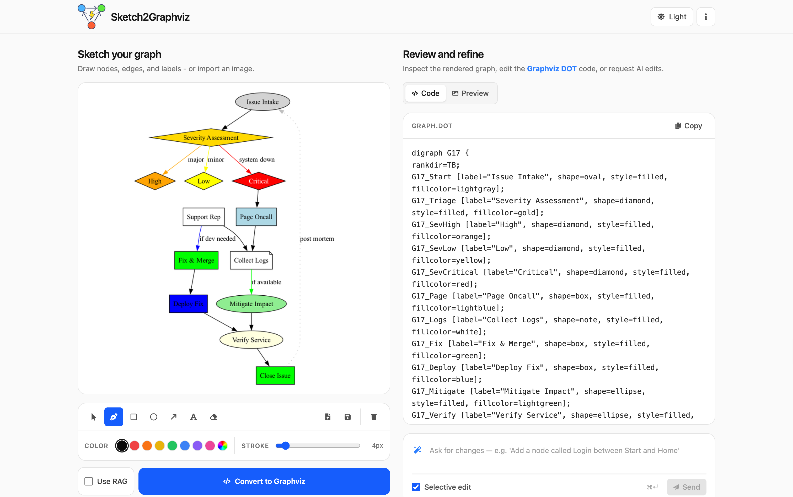
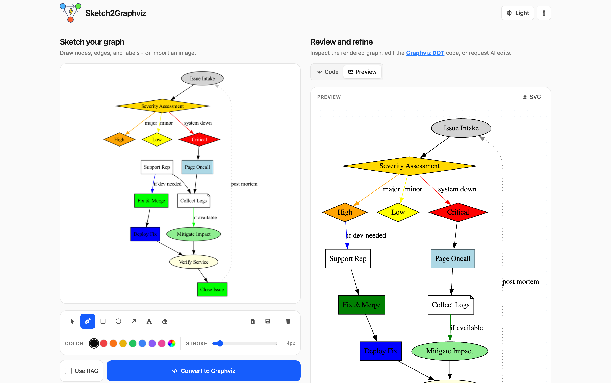
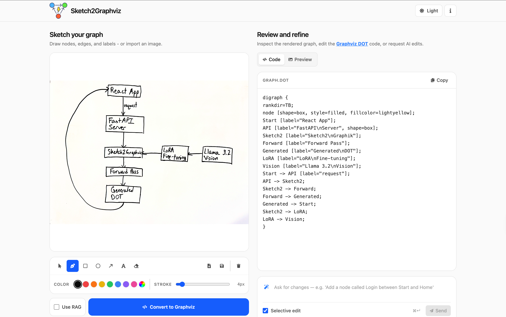
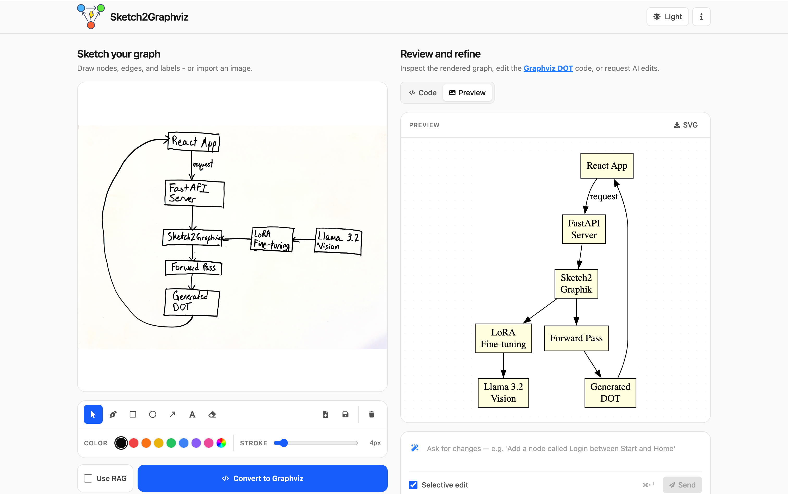

# Sketch2Graphviz

<p align="center">
  
</p>

<p align="center">
  <strong>Convert hand-drawn sketches and images of graphs into proper Graphviz DOT code using a fine-tuned Vision-Language Model with Retrieval-Augmented Generation.</strong>
</p>


<p align="center">
  <a href="#features">Features</a> &bull;
  <a href="#demos">Demos</a> &bull;
  <a href="#architecture">Architecture</a> &bull;
  <a href="#getting-started">Getting Started</a> &bull;
  <a href="#api-reference">API Reference</a> &bull;
  <a href="#model-details">Model Details</a> &bull;
  <a href="#evaluation-results">Evaluation Results</a>
</p>

---

## Demos

 

 

---

## Features

- **Sketch-to-Code Conversion** - Draw a graph or flowchart on an interactive canvas, or upload an image, and get Graphviz DOT code generated automatically
- **RAG-Enhanced Generation** - Retrieval-Augmented Generation via a PostgreSQL/PGVector vector database provides few-shot examples for higher quality output (89.07% vs 86.17% LLM-as-Judge accuracy)
- **Live Graphviz Rendering** - Generated DOT code is rendered as an SVG in real time, with download options for SVG and PNG
- **Code Editing** - Refine generated code with natural language edit requests using rewrite or selective edit modes
- **Interactive Drawing Canvas** - Full-featured sketchpad with multiple shapes, colors, and drawing tools built with Konva

---

## Architecture

**Sketch2Graphviz** uses a **LoRA fine-tuned Llama 3.2 11B Vision Instruct** model as its core Vision-Language Model (VLM). At inference time, the input image is embedded using the VLM's vision encoder, and a similarity search against a **PostgreSQL + PGVector** vector database retrieves the top-K most similar Graphviz DOT code samples. These retrieved examples are injected into the prompt as few-shot context before the model generates the final DOT code.

| Component             | Technology                           |
| --------------------- | ------------------------------------ |
| Vision-Language Model | Llama 3.2 11B Vision Instruct + LoRA |
| Vector Database       | PostgreSQL + PGVector                |
| Backend API           | FastAPI + Uvicorn                    |
| Frontend              | React 19, Vite, Tailwind CSS         |
| Drawing Canvas        | Konva / react-konva                  |
| Graphviz Rendering    | Viz.js                               |
| Containerization      | Docker                               |
| Deployment            | Runpod (GPU)                         |

---

## Project Structure

```
Sketch2Graphviz/
├── client/                          # React + Vite frontend
│   ├── public/
│   │   └── assets/                  # Static assets (icon, etc.)
│   ├── src/
│   │   ├── api/
│   │   │   ├── server.js            # API client for FastAPI server
│   │   │   └── axios.js             # Axios instance configuration
│   │   ├── components/
│   │   │   └── GraphSketchpad.jsx   # Interactive Konva drawing canvas
│   │   ├── App.jsx                  # Main app layout, state, rendering
│   │   └── main.jsx                 # React entry point
│   ├── package.json
│   └── vite.config.js
│
├── model/                           # Python backend and ML model
│   ├── main.py                      # FastAPI server entry point
│   ├── llm_judge.py                 # LLM-based evaluation (Azure AI)
│   ├── pyproject.toml               # Python project + dependencies (uv)
│   ├── uv.lock                      # Locked, reproducible dependency graph
│   ├── .python-version              # Pinned Python version for uv
│   ├── Dockerfile                   # Full-stack Docker image
│   ├── scripts/
│   │   ├── model.py                 # Sketch2GraphvizVLM model class
│   │   ├── inference.py             # Inference pipeline with RAG
│   │   ├── finetune_lora.py         # LoRA fine-tuning loop
│   │   ├── eval.py                  # Evaluation metrics (SSIM, LPIPS, F1, etc.)
│   │   ├── data.py                  # Dataset classes and augmentations
│   │   ├── prompts.py               # System and generation prompts
│   │   ├── graphviz_renderer.py     # DOT code to PNG rendering
│   │   ├── embeddings.py            # Image embedding generation for RAG
│   │   ├── selective_edit.py        # Selective JSON-based code editing
│   │   ├── psql_vector_db.py        # Vector DB operations (PGVector)
│   │   └── synthetic_data_gen.py    # Synthetic DOT data generation (OpenAI)
│   ├── lora_checkpoints/            # Saved LoRA adapter weights
│   │   ├── epoch_1_vlm_lora/
│   │   ├── epoch_2_vlm_lora/
│   │   └── epoch_3_vlm_lora/
│   ├── tests/                       # Pytest unit tests
│   │   ├── test_selective_edit.py   # Tests for selective edit pipeline
│   │   └── test_eval.py             # Tests for graph evaluation metrics
│   ├── testing_graphs/              # Test images for evaluation
│   ├── outputs/                     # Model output artifacts
│   ├── postgreSQL_data/             # PostgreSQL database dump
│   └── results.md                   # Model evaluation results
│
├── data/                            # Synthetic training datasets (JSON)
│   ├── simple_synthetic_data_gen.json
│   ├── synthetic_data_gen.json
│   └── complex_synthetic_data_gen.json
│
├── README.md
└── .env
```

---

## Getting Started

### Prerequisites

- **Node.js** (v18+) and **npm** for the frontend
- **[uv](https://docs.astral.sh/uv/)** (0.5+) for Python dependency and environment management — uv manages Python itself (3.13, pinned via `.python-version`), so you don't need a system Python install
- **Docker** for containerized deployment (NVIDIA driver with CUDA 13 support on the host if running the GPU image)
- A **HuggingFace** account with access to the gated [meta-llama/Llama-3.2-11B-Vision-Instruct](https://huggingface.co/meta-llama/Llama-3.2-11B-Vision-Instruct) model
- A GPU with **12-16 GB VRAM** (4-bit quantized model) or **24 GB VRAM** (16-bit quantized model)

### Clone the Repository

```bash
git clone https://github.com/RishabSA/Sketch2Graphviz.git
cd Sketch2Graphviz
```

### Frontend Setup

```bash
cd client
npm install
```

Create a `.env` file in the `client/` directory with the server URL:

```env
VITE_SERVER_URL=https://<YOUR_SERVER_URL>
```

Start the development server:

```bash
npm run dev
```

The frontend will be available at `http://localhost:5173`.

### Backend Setup (Local, uv)

All backend Python dependencies are managed with [uv](https://docs.astral.sh/uv/) via `model/pyproject.toml` and the locked `model/uv.lock`.

Then sync the environment (uv will download the pinned Python version and resolve every dependency from the lockfile):

```bash
cd model
uv sync --frozen
```

This creates `model/.venv/`. Run any backend command through uv so it uses the locked environment:

```bash
uv run uvicorn main:app --host 0.0.0.0 --port 8000
uv run python scripts/inference.py
uv run python llm_judge.py
```

> Note: The backend also requires a running PostgreSQL instance with the `pgvector` extension for RAG. The Docker image below provisions this automatically; for local runs you'll need to set it up yourself.

### Running Unit Tests

The backend includes a Pytest unit test cases under `model/tests/` covering the selective edit pipeline (`scripts/selective_edit.py`) and the graph evaluation metrics (`scripts/eval.py`).

Run the full test cases:

```bash
uv run pytest tests/
```

### Docker Deployment (Backend)

The pre-built Docker image is available on DockerHub:

```bash
docker pull rishabsa/sketch2graphviz:latest
```

Or build from source:

```bash
cd model
docker buildx build --platform linux/amd64 -t sketch2graphviz:latest .
```

### Runpod Deployment

1. Create a pod with an appropriate GPU (~12-16 GB VRAM for 4-bit quantized, ~24 GB VRAM for 16-bit). An RTX A5000 (24 GB) works well for the 4-bit model.
2. Use the **`rishabsa/sketch2graphviz:latest`** Docker image as the template
3. Set the container disk and volume disk storage both to **~40 GB**
4. Expose HTTP port **`8000`**
5. Set an environment variable `HF_TOKEN` with a HuggingFace token that has read permissions
6. Uncheck "Start Jupyter notebook"
7. Deploy the pod on-demand

> **Note:** You must have been granted access to `meta-llama/Llama-3.2-11B-Vision-Instruct` on HuggingFace as it is a gated model.

On startup, the FastAPI server will download and load the base model into VRAM with 4-bit quantization, load the LoRA adapters from storage, and initialize the PostgreSQL + PGVector database with pre-computed embeddings.

### Verify the Server

```bash
curl -X POST https://<RUNPOD_POD>-8000.proxy.runpod.net/graphviz_code_from_image \
  -F "file=@model/testing_graphs/graph_6.png"
```

---

## API Reference

### `POST /graphviz_code_from_image`

Generate Graphviz DOT code from an image.

**Request:**

| Parameter   | Type       | Location  | Description                                           |
| ----------- | ---------- | --------- | ----------------------------------------------------- |
| `file`      | File (PNG) | Form data | Image of a graph or flowchart                         |
| `use_rag`   | Boolean    | Header    | Enable RAG retrieval (default: `true`)                |
| `top_K_rag` | Integer    | Header    | Number of similar examples to retrieve (default: `5`) |

**Response:** Plain text Graphviz DOT code

**Example:**

```bash
curl -X POST https://<SERVER_URL>/graphviz_code_from_image \
  -F "file=@image.png" \
  -H "use_rag: true" \
  -H "top_K_rag: 5"
```

### `POST /graphviz_code_edit`

Edit existing Graphviz DOT code using natural language instructions.

**Request Body (JSON):**

| Field                   | Type    | Description                               |
| ----------------------- | ------- | ----------------------------------------- |
| `edit_text`             | String  | Natural language description of the edit  |
| `graphviz_code`         | String  | Existing DOT code to modify               |
| `use_selective_changes` | Boolean | Use selective edit mode (default: `true`) |

**Response:** Updated Graphviz DOT code

**Example:**

```bash
curl -X POST https://<SERVER_URL>/graphviz_code_edit \
  -H "Content-Type: application/json" \
  -d '{
    "edit_text": "change all node colors to lightblue",
    "graphviz_code": "digraph { A -> B; B -> C; }",
    "use_selective_changes": true
  }'
```

---

## Model Details

### Base Model and Fine-Tuning

| Parameter              | Value                                                                                          |
| ---------------------- | ---------------------------------------------------------------------------------------------- |
| Base Model             | `meta-llama/Llama-3.2-11B-Vision-Instruct` (11B parameters)                                    |
| Fine-Tuning Method     | LoRA (Low-Rank Adaptation)                                                                     |
| LoRA Rank              | 64                                                                                             |
| LoRA Alpha             | 128                                                                                            |
| LoRA Dropout           | 0.05                                                                                           |
| Target Modules         | q_proj, k_proj, v_proj, o_proj, gate_proj, up_proj, down_proj, fc1, fc2, multi_modal_projector |
| Training Quantization  | 16-bit                                                                                         |
| Inference Quantization | 4-bit                                                                                          |

### Training Configuration

| Parameter                   | Value                                           |
| --------------------------- | ----------------------------------------------- |
| Epochs                      | 3                                               |
| Batch Size                  | 1 (per GPU)                                     |
| Gradient Accumulation Steps | 16 (effective batch size of 16)                 |
| Optimizer                   | AdamW                                           |
| Learning Rate               | 2e-4 with linear warmup (10% of training steps) |

### Synthetic Data Generation

Because no publicly available Graphviz datasets provide DOT code of sufficient quality, training data was synthesized using the OpenAI API (`gpt-4o-mini`). Specific graph types are generated with prompt suffixes that specify different node types, edge types, and attributes across batches. The datasets include:

| Dataset         | Samples |
| --------------- | ------- |
| Simple graphs   | ~447    |
| Standard graphs | ~700+   |
| Complex graphs  | ~298    |

### Retrieval-Augmented Generation (RAG)

1. **Embedding:** Input images are passed through the VLM's vision encoder to extract hidden states. These are mean-pooled across token positions and L2-normalized to produce a 4096-dimensional embedding vector.
2. **Storage:** Embeddings and their corresponding DOT code are stored in PostgreSQL with the PGVector extension.
3. **Retrieval:** At inference time, the input image is embedded, and the top-K most similar embeddings are retrieved by Euclidean (L2) distance.
4. **Prompting:** The DOT code corresponding to the retrieved embeddings is injected into the model's prompt as few-shot examples.

### Editing Modes

**Rewrite Edit:** The full DOT code and edit request are sent to the model, which regenerates the entire code with the requested changes applied.

**Selective Edit:** The DOT code is split into indexed statements. The model outputs a JSON action plan:

```json
{
	"actions": [
		{ "command": "add", "idx": 3, "content": "A -> D [label=\"new edge\"];" },
		{ "command": "edit", "idx": 5, "content": "B [shape=diamond];" },
		{ "command": "delete", "idx": 7 }
	]
}
```

Each action is validated and applied to the original code, allowing precise modifications without regenerating unrelated parts.

---

## Evaluation Results

### Test Loss by Epoch

| Epoch | Test Loss |
| ----- | --------- |
| 1     | 0.1974    |
| 2     | 0.1466    |
| 3     | 0.1296    |

### Final Model Evaluation (Epoch 3, No RAG)

| Metric                 | Value            |
| ---------------------- | ---------------- |
| Render Success Rate    | 97.96% (914/933) |
| Mean SSIM              | 0.9306           |
| Mean LPIPS             | 0.1352           |
| Graph Isomorphism Rate | 43.52%           |
| Node F1                | 0.5453           |
| Edge F1                | 0.4974           |
| Node Attribute F1      | 0.4879           |
| Edge Attribute F1      | 0.4703           |

### LLM-as-a-Judge Accuracy

| Configuration | Correct | Total | Accuracy   |
| ------------- | ------- | ----- | ---------- |
| Without RAG   | 804     | 933   | **86.17%** |
| With RAG      | 831     | 933   | **89.07%** |

RAG improves LLM-as-Judge accuracy by **2.90%**, demonstrating the value of few-shot prompting with retrieved examples.
