# Results

## Model Checkpoint Testing Results

Epoch 1:
**Test Loss:** 0.197370

Epoch 2:
**Test Loss:** 0.146568

Epoch 3:
**Test Loss:** 0.129601

## Final Model Evaluation Results

**Test Loss:** 0.129601

## Model Generations on Select Examples

### complex_graph_1.png

**No RAG:**

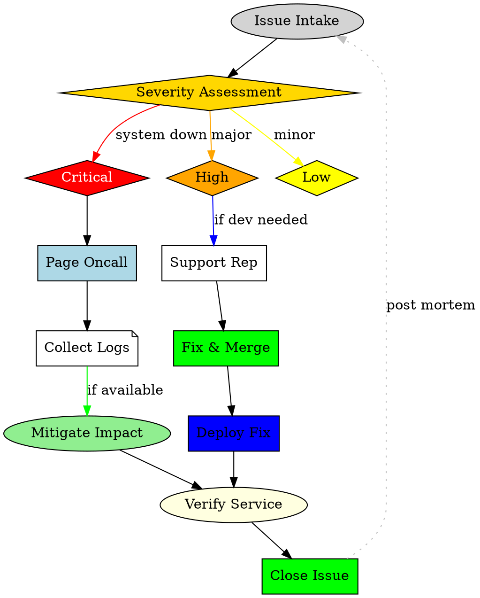

**RAG:**

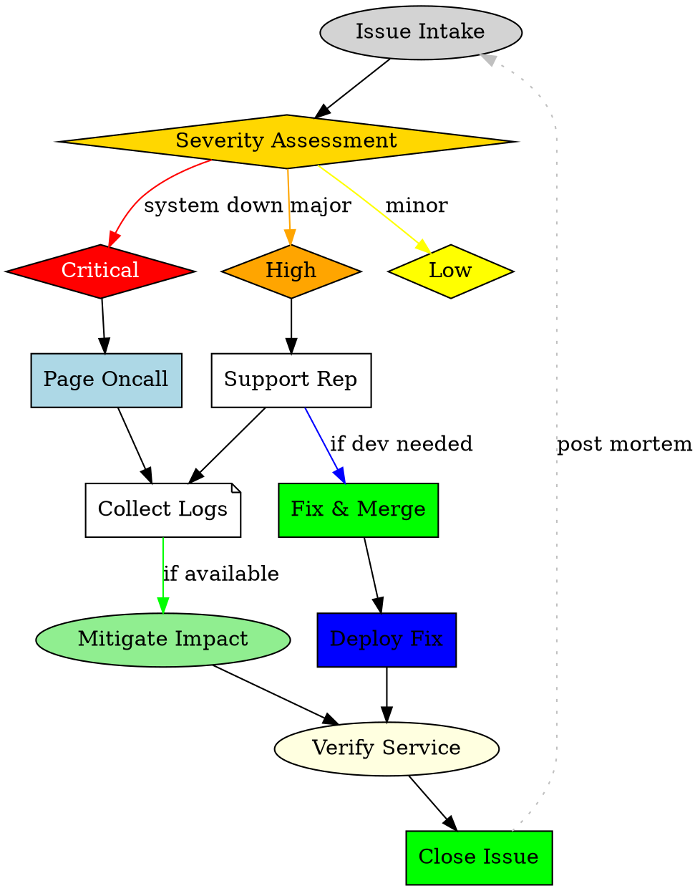

### complex_graph_2.png

**No RAG:**

```dot
digraph ApprovalFlow9 {
rankdir=LR;
node [shape=box, style=filled, color=white];
Start [label="Start", shape=circle, color=green, fontcolor=white];
Req [label="License Request", shape=component, color=lightblue];
IT [label="IT Check", shape=diamond, color=purple];
Legal [label="Legal", shape=oval, color=red];
Finance [label="Finance", shape=oval, color=red];
VP [label="VP Approve", shape=oval, color=brown];
Escalate [label="Escalate VP", shape=oval, color=brown];
Timeout [label="Timeout Handler", shape=hexagon, color=gray];
AutoCancel [label="Auto Cancel", shape=note, color=red];
Grant [label="Grant License", shape=note, color=green];
Archive [label="Archive", shape=folder, color=black];
Start -> Req;
Req -> IT [label="needs legal", color=blue];
IT -> Legal [label="legal approval", color=purple];
IT -> Finance [label="cost approval", color=purple];
Legal -> VP [label="vp ok", color=red];
Finance -> VP [label="vp approve", color=red];
VP -> Grant [label="grant", color=brown];
VP -> Escalate [label="auto-escalate", color=brown];
IT -> Timeout [label="no reply", style=dashed, color=gray];
Finance -> Timeout [label="budget check", color=blue];
Timeout -> Escalate [label="auto-escalate", color=gray];
Escalate -> Archive [label="archive", color=brown];
Grant -> Archive [color=green];
AutoCancel -> Archive [color=red];
}
```

**RAG:**

```dot
digraph ApprovalFlow49 {
rankdir=LR;
node [shape=box, style=filled, color=white];
Start [label="Start", shape=circle, color=green, fontcolor=white];
Req [label="License Request", shape=component, color=lightblue];
Intake [label="IT Check", shape=diamond, color=purple];
CFO [label="CFO", shape=oval, color=navy];
Escalate [label="Escalate Chair", shape=oval, color=brown];
Timeout [label="Timeout Handler", shape=hexagon, color=gray];
AutoApprove [label="Auto Approve", shape=note, color=green];
Reject [label="Reject", shape=note, color=red];
Archive [label="Archive", shape=folder, color=black];
Start -> Req;
Req -> Intake [label="intake", color=blue];
Intake -> CFO [label="cfo?", color=purple];
CFO -> AutoApprove [label="approve", color=navy];
CFO -> Escalate [label="escalate", color=navy];
Intake -> Timeout [label="no reply", style=dashed, color=gray];
Timeout -> Escalate [label="auto-escalate", color=gray];
Escalate -> AutoApprove [label="override", color=brown];
Escalate -> Reject [label="deny", color=brown];
AutoApprove -> Archive [color=green];
Reject -> Archive [color=red];
Req -> Escalate [label="fast-track", style=dotted, color=blue];
}
```

### complex_graph_3.png

**No RAG:**

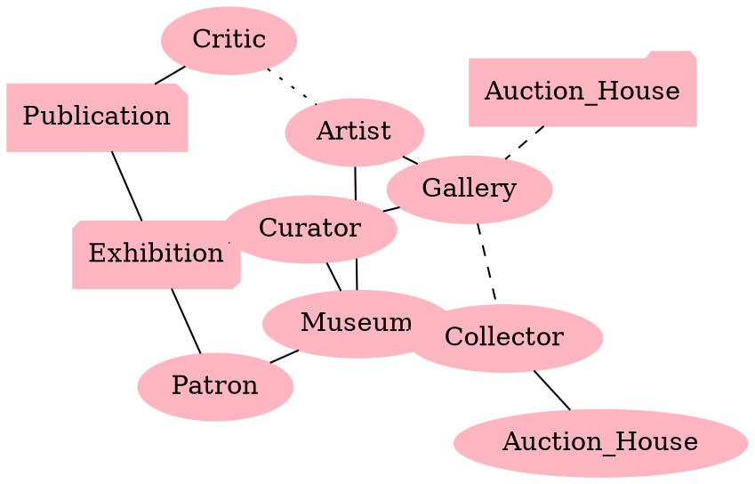

**RAG:**

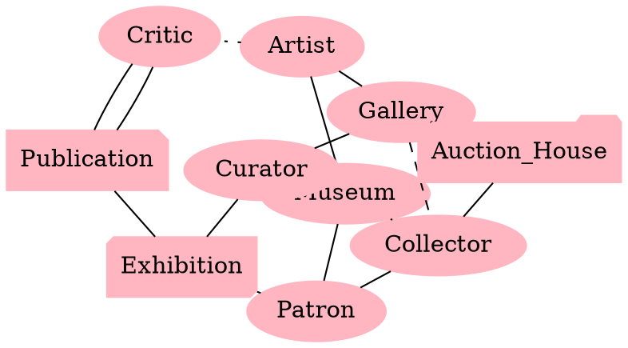

### simple_decision_tree.png

**No RAG:**

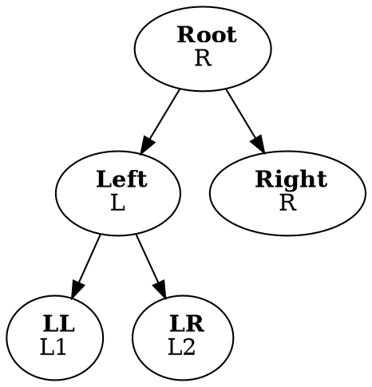

**RAG:**


### flowchart.jpg

**No RAG:**

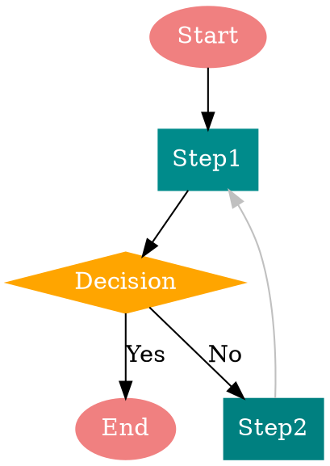

**RAG:**

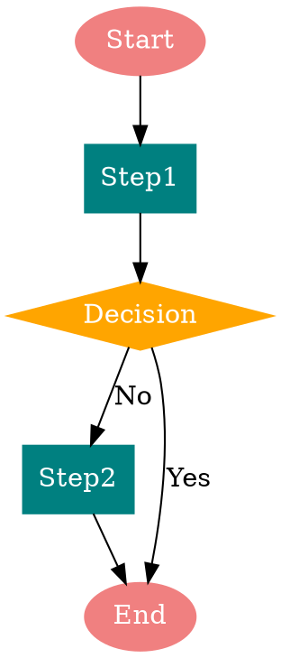

### Sketch2Graphviz_pipeline.jpg

**No RAG:**

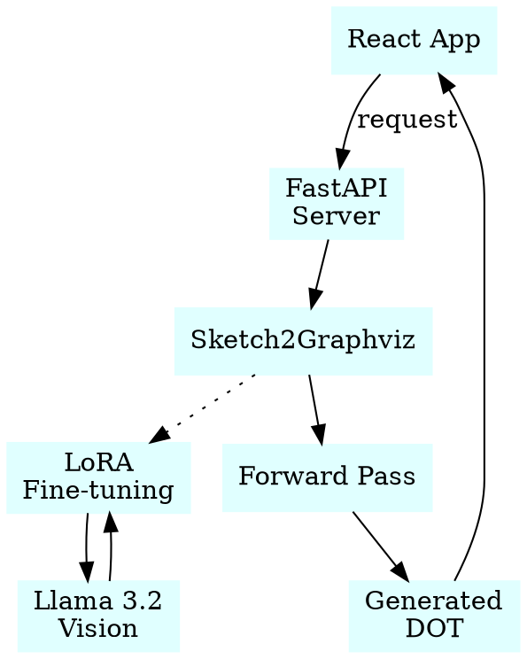

### test_140.png

**No RAG:**

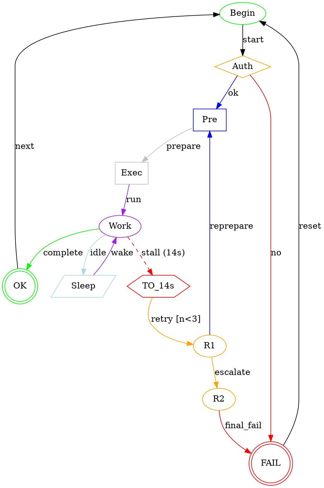

**RAG:**


### test_143.png

**No RAG:**

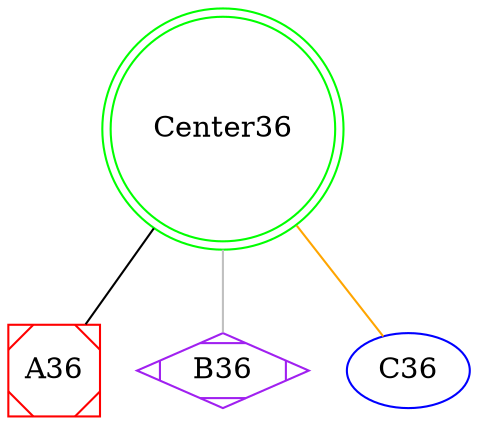

**RAG:**

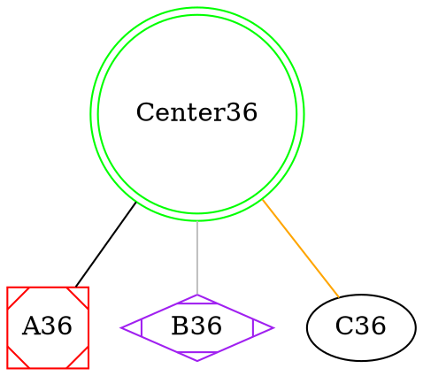

### test_148.png

**No RAG:**

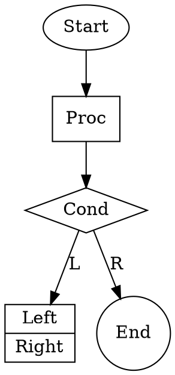

**RAG:**


### test_149.png

**No RAG:**

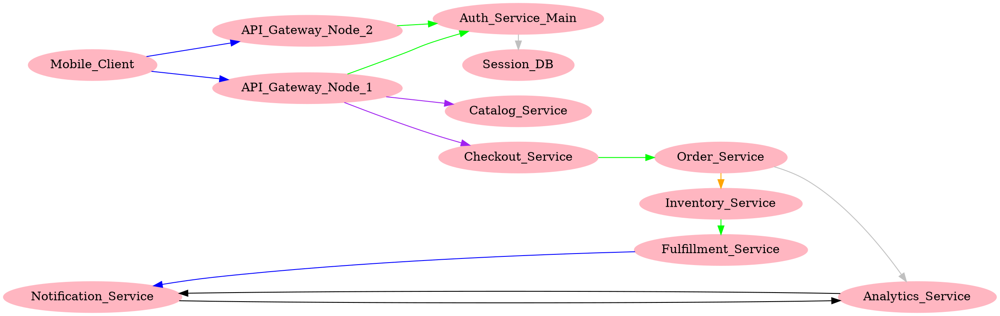

**RAG:**

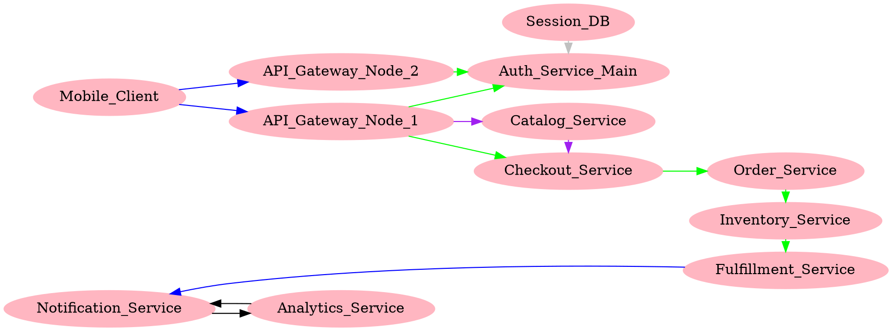

### test_158.png

**No RAG:**

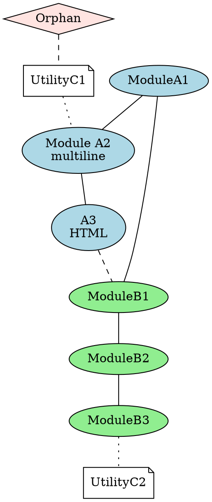

**RAG:**

```dot
graph G {
layout=dot;
node [style=filled];
Orphan [label="Orphan", shape=diamond, fillcolor=mistyrose];
UI1 [label="Module A1", fillcolor=lightblue];
UI2 [label="Module A2\nmultiline", fillcolor=lightblue];
UI3 [label="Module A3\nHTML", fillcolor=lightblue];
UI4 [label="Module B1", fillcolor=lightgreen];
UI5 [label="Module B2", fillcolor=lightgreen];
UI6 [label="Module B3", fillcolor=lightgreen];
Storage [label="Utility C1", shape=note, fillcolor=white];
Cache [label="Utility C2", shape=note, fillcolor=white];
Orphan -- Storage [style=dashed];
UI1 -- UI2;
UI2 -- UI3;
UI3 -- UI4;
UI4 -- UI5;
UI5 -- UI6;
UI6 -- Storage [style=dotted];
UI4 -- Storage [style=dashed];
UI2 -- Cache [style=dotted];
UI3 -- Cache [style=dashed];
UI1 -- UI6 [style=dotted];
}
```

### test_814.png

**No RAG:**

```dot
digraph Pipeline_5 {
  rankdir=LR;
  subgraph cluster_ingest { label="ingest"; color=blue;
    FTP_In [shape=folder, style=filled, fillcolor=white];
    Gateway [shape=box, style=filled, fillcolor=lightcyan];
  }
  subgraph cluster_processing { label="processing"; color=green;
    Executor_1 [shape=box, style=filled, fillcolor=white];
    Executor_2 [shape=box, style=filled, fillcolor=white];
    Compressor [shape=hexagon, style=filled, fillcolor=white];
    Scheduler [shape=diamond, style=filled, fillcolor=white];
  }
  subgraph cluster_storage { label="storage"; color=orange;
    Main_DB [shape=cylinder, style=filled, fillcolor=beige];
    Backup_DB [shape=cylinder, style=filled, fillcolor=beige];
    RedisStore [shape=component, style=filled, fillcolor=white];
  }
  subgraph cluster_management { label="management"; color=purple;
    Admin_UI [shape=record, style=filled, fillcolor=lavender];
    Public_API [shape=record, style=filled, fillcolor=lavender];
  }
  Metrics [shape=oval, style=filled, fillcolor=white];

  FTP_In -> Gateway [label="transfer", color=blue];
  Gateway -> Scheduler [label="enqueue", color=blue];
  Scheduler -> Executor_1 [label="assign", color=green];
  Scheduler -> Executor_2 [label="assign", color=green];
  Executor_1 -> Compressor [label="compress", color=green];
  Executor_2 -> Compressor [label="compress", color=green];
  Compressor -> Main_DB [label="store_file", color=orange];
  Main_DB -> Backup_DB [label="replicate", color=orange];
  RedisStore -> Main_DB [label="read_write", color=orange];
  Admin_UI -> Public_API [label="manage", color=purple];
  Public_API -> Executor_1 [label="process", color=purple];
  Public_API -> Executor_2 [label="process", color=purple];
  Metrics -> Executor_1 [label="perf", color=gray];
  Metrics -> Executor_2 [label="perf", color=gray];
  Gateway -> Metrics [label="ingest_stats", color=gray];
  Admin_UI -> RedisStore [label="download", color=purple];
}
```

**RAG:**

```dot
digraph Pipeline_3 {
rankdir=LR;
subgraph cluster_ingest { label="ingest"; color=blue;
FTP_In [shape=folder, style=filled, fillcolor=lightcyan];
Gateway [shape=box, color=blue];
}
subgraph cluster_processing { label="processing"; color=green;
Executor_1 [shape=box, style=filled, fillcolor=white];
Executor_2 [shape=box, color=green];
Job_Scheduler [shape=diamond, color=green];
}
subgraph cluster_storage { label="storage"; color=orange;
Main_DB [shape=cylinder, style=filled, fillcolor=beige];
Backup_DB [shape=cylinder, color=orange];
Archive [shape=folder, color=orange];
}
subgraph cluster_serving { label="serving"; color=purple;
Public_API [shape=rect, style=filled, fillcolor=lavender];
Admin_UI [shape=note, color=purple];
}
Logger [shape=note, color=gray];
Metrics [shape=oval, color=gray];
FTP_In -> Gateway [label="transfer", color=blue];
Gateway -> Job_Scheduler [label="enqueue", color=blue];
Job_Scheduler -> Executor_1 [label="assign", color=green];
Job_Scheduler -> Executor_2 [label="assign", color=green];
Executor_1 -> Main_DB [label="store", color=orange];
Executor_2 -> Backup_DB [label="replicate", color=orange];
Executor_1 -> Archive [label="compress", color=green];
Executor_2 -> Archive [label="compress", color=green];
Main_DB -> Public_API [label="read_write", color=purple];
Backup_DB -> Public_API [label="read_only", color=purple];
Public_API -> Admin_UI [label="manage", color=purple];
Metrics -> Logger [label="perf", color=gray];
Logger -> Metrics [label="log", color=gray];
Gateway -> Metrics [label="gateway_stats", color=gray];
Executor_1 -> Logger [label="executor_log", color=gray];
Executor_2 -> Logger [label="executor_log", color=gray];
}
```

### test_840.png

**No RAG:**

```dot
digraph ServiceMesh {
rankdir=LR;
Gateway[label=Gateway shape=diamond color=gray style=filled];
Auth[label=Auth_Service shape=component color=lightgreen style=filled];
User[label=User_Service shape=component color=lightblue style=filled];
Order[label=Order_Service shape=component color=yellow style=filled];
Inventory[label=Inventory_Service shape=component color=lightpink style=filled];
Payment[label=Payment_Service shape=component color=orange style=filled];
Reporting[label=Reporting shape=note color=cyan style=filled];
Queue[label=Queue shape=oval color=gray style=filled];
DB_Main[label=Main_DB shape=cylinder color=gold style=filled];
Gateway -> Auth color=black;
Gateway -> User color=black;
Gateway -> Order color=black;
Order -> Inventory color=purple;
Order -> Payment color=red;
Payment -> DB_Main color=brown;
Inventory -> DB_Main color=brown;
Order -> Queue color=gray style=dotted;
Queue -> Reporting color=green style=dashed;
Reporting -> DB_Main color=black style=dotted;
Auth -> DB_Main color=orange style=dashed;
User -> DB_Main color=magenta style=dashed;
Inventory -> Reporting color=cyan style=dotted;
}
```

**RAG:**

```dot
digraph Microservices_Orchestration {
rankdir=LR;
node [shape=box, style=filled, color=lightblue];
Gateway [label="Gateway", shape=diamond, color=gray];
Auth_Service [label="Auth_Service", shape=component, color=lightgreen];
User_Service [label="User_Service", shape=component, color=lightblue];
Order_Service [label="Order_Service", shape=component, color=yellow];
Payment_Service [label="Payment_Service", shape=component, color=orange];
Inventory_Service [label="Inventory_Service", shape=component, color=pink];
Queue [label="Queue", shape=oval, color=gray];
Reporting [label="Reporting", shape=note, color=cyan];
DB_Main [label="Main_DB", shape=cylinder, color=gold];
Cache [label="Cache", shape=oval, color=white];
Gateway -> Auth_Service [color=black];
Gateway -> User_Service [color=black];
Gateway -> Order_Service [color=black];
Auth_Service -> DB_Main [color=green, style=dashed];
User_Service -> DB_Main [color=green, style=dashed];
Order_Service -> Payment_Service [color=red];
Order_Service -> Inventory_Service [color=purple];
Inventory_Service -> DB_Main [color=brown];
Payment_Service -> DB_Main [color=brown];
Order_Service -> Queue [color=gray, style=dotted];
Queue -> Reporting [color=green, style=dashed];
Reporting -> DB_Main [color=black, style=dotted];
Cache -> User_Service [color=grey, style=dotted];
Order_Service -> Reporting [color=cyan, style=dotted];
Payment_Service -> Reporting [color=cyan, style=dotted];
}
```

### test_851.png

**No RAG:**

```dot
digraph G4 {
  rankdir=TB;
  subgraph cluster_ingest { label="Ingest"; color=blue;
    Collector4 [shape=box, style=filled, fillcolor=lightcyan];
    Hook4 [shape=box, color=blue];
  }
  subgraph cluster_processing { label="Processing"; color=green;
    Queue4 [shape=oval, style=filled, fillcolor=lightgreen];
    Worker4A [shape=box, color=green];
    Worker4B [shape=box, color=green];
  }
  subgraph cluster_storage { label="Storage"; color=orange;
    File4 [shape=component, color=orange];
    Main4 [shape=cylinder, style=filled, fillcolor=beige];
  }
  subgraph cluster_serving { label="Serving"; color=purple;
    Portal4 [shape=note, color=purple];
    API4 [shape=rect, color=purple];
  }
  Observ4 [shape=note, color=gray];

  Collector4 -> Queue4 [label="publish", color=blue];
  Hook4 -> Queue4 [label="webhook", color=blue];
  Queue4 -> Worker4A [label="popA", color=green];
  Queue4 -> Worker4B [label="popB", color=green];
  Worker4A -> Main4 [label="db_write", color=orange];
  Worker4B -> File4 [label="store_blob", color=orange];
  Main4 -> API4 [label="db_query", color=purple];
  File4 -> Portal4 [label="serve_files", color=purple];
  Observ4 -> Queue4 [label="queue_monitor", color=gray];
  Observ4 -> Main4 [label="db_monitor", color=gray];
  Hook4 -> Observ4 [label="hook_metric", color=gray];
  Collector4 -> Observ4 [label="collect_metric", color=gray];
  Worker4A -> Observ4 [label="worker_metric", color=gray];
  Worker4B -> Observ4 [label="worker_metric", color=gray];
  API4 -> Observ4 [label="api_metric", color=gray];
}
```

**RAG:**

```dot
digraph Flow_4 {
  rankdir=TB;
  subgraph cluster_ingest { label="Ingest"; color=blue;
    Collector4 [shape=box, style=filled, fillcolor=lightcyan];
    Hook4 [shape=box, color=blue];
  }
  subgraph cluster_processing { label="Processing"; color=green;
    Queue4 [shape=oval, style=filled, fillcolor=lightgreen];
    Worker4A [shape=box, color=green];
    Worker4B [shape=box, color=green];
  }
  subgraph cluster_storage { label="Storage"; color=orange;
    Main4 [shape=cylinder, style=filled, fillcolor=beige];
    File4 [shape=component, color=orange];
  }
  subgraph cluster_serving { label="Serving"; color=purple;
    Portal4 [shape=note, style=filled, fillcolor=lavender];
    API4 [shape=rect, color=purple];
  }
  Observ4 [shape=note, color=gray];

  Collector4 -> Queue4 [label="publish", color=blue];
  Hook4 -> Queue4 [label="publish", color=blue];
  Queue4 -> Worker4A [label="popA", color=green];
  Queue4 -> Worker4B [label="popB", color=green];
  Worker4A -> Main4 [label="db_write", color=orange];
  Worker4B -> File4 [label="store_blob", color=orange];
  Main4 -> API4 [label="db_query", color=purple];
  File4 -> Portal4 [label="serve_files", color=purple];
  Observ4 -> Queue4 [label="queue_monitor", color=gray];
  Observ4 -> Worker4A [label="worker_metric", color=gray];
  Observ4 -> Worker4B [label="worker_metric", color=gray];
  Hook4 -> Observ4 [label="hook_metric", color=gray];
  Collector4 -> Observ4 [label="collect_metric", color=gray];
  Portal4 -> Observ4 [label="api_metric", color=gray];
  Main4 -> Observ4 [label="db_monitor", color=gray];
}
```

### test_965.png

**No RAG:**

```dot
digraph G {
rankdir=LR;
node [shape=ellipse, style=filled];
Start [label="Alpha_Start", fillcolor=lightblue];
TaskA [label="Alpha_Task_A", shape=box, color=blue];
TaskB [label="Alpha_Task_B", shape=box, color=blue, style=dashed];
Checkpoint1 [label="Checkpoint_1", shape=doublecircle, color=red, style=filled, fillcolor=yellow];
ForkX [label="Fork_X", shape=diamond, color=purple];
TaskC [label="Beta_Task_A", shape=box, color=green];
TaskD [label="Beta_Task_B", shape=box, color=green, style=dotted];
Checkpoint2 [label="Checkpoint_2", shape=doublecircle, color=orange, style=filled, fillcolor=lightgrey];
Merge2 [label="Merge_2", shape=doublecircle, color=orange, style=filled, fillcolor=gray];
End [label="Beta_Start", shape=oval, color=black, style=filled, fillcolor=lightgreen];
Start -> TaskA [color=blue];
TaskA -> TaskB [color=blue];
TaskB -> Checkpoint1 [color=blue];
Checkpoint1 -> ForkX [color=red];
ForkX -> TaskC [label="path1", color=purple];
ForkX -> TaskD [label="path2", color=purple, style=dashed];
TaskC -> Checkpoint2 [color=purple];
TaskD -> Checkpoint2 [color=purple, style=dotted];
Checkpoint2 -> Merge2 [color=orange];
Merge2 -> End [color=black];
TaskC -> End [color=green];
TaskD -> End [color=green];
Checkpoint1 -> Merge2 [color=red, style=dashed];
Start -> ForkX [color=gray, style=dotted];
}
```

**RAG:**

```dot
digraph ParallelFlow_40 {
rankdir=LR;
node [shape=box, style=filled];
subgraph cluster_alpha {
label="Track Alpha";
Alpha_Start [label="Alpha_Start", shape=oval, style=filled, fillcolor=lightblue];
Alpha_TaskA [label="Alpha_Task_A", shape=box, color=blue];
Alpha_TaskB [label="Alpha_Task_B", shape=box, color=blue, style=dashed];
}
subgraph cluster_beta {
label="Track Beta";
Beta_Start [label="Beta_Start", shape=oval, style=filled, fillcolor=lightgreen];
Beta_TaskA [label="Beta_Task_A", shape=box, color=green];
Beta_TaskB [label="Beta_Task_B", shape=box, color=green, style=dotted];
}
Checkpoint1 [label="Checkpoint_1", shape=doublecircle, color=red, style=filled, fillcolor=yellow];
Checkpoint2 [label="Merge_2", shape=doublecircle, color=orange, style=filled, fillcolor=lightgray];
ForkX [label="Fork_X", shape=diamond, color=purple];
Report [label="Audit", shape=note, color=gray];
Init [label="Init", shape=oval, style=filled, fillcolor=gold];
Init -> Alpha_Start;
Init -> Beta_Start;
Alpha_Start -> Alpha_TaskA;
Alpha_TaskA -> Alpha_TaskB;
Alpha_TaskB -> Checkpoint1;
Beta_Start -> Beta_TaskA;
Beta_TaskA -> Beta_TaskB;
Beta_TaskB -> Checkpoint1;
Checkpoint1 -> ForkX;
ForkX -> Alpha_TaskA [label="path1", color=purple];
ForkX -> Beta_TaskB [label="path2", color=purple, style=dashed];
Checkpoint1 -> Report [color=red, style=bold];
Checkpoint2 -> Report [color=gray, style=dotted];
Alpha_TaskB -> Checkpoint2 [color=blue, style=dashed];
Beta_TaskA -> Checkpoint2 [color=green, style=dashed];
Checkpoint2 -> Init [color=gold, style=dotted];
}
```
